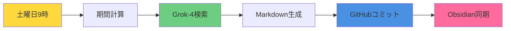

# 🤖 n8n 自動化ワークフロー

AIニュース収集・管理システム用のn8nワークフロー自動化を提供するリポジトリです。

## 📋 利用可能なワークフロー

### 📰 [Grok News Discord](./grok-news-discord.md)
**Discord通知システム**

- **目的**: X（Twitter）からの週次AIニュース収集とDiscord通知
- **スケジュール**: 毎週土曜日の朝9時
- **出力**: 厳選されたAIニュースのDiscord通知
- **特徴**: シンプルなリアルタイム通知

[📄 要件・ドキュメントを見る →](./grok-news-discord.md)

---

### 📚 [Grok News Obsidian](./grok-news-obsidian.md)
**Obsidian連携ナレッジマネジメントシステム**

- **目的**: 構造化されたObsidianナレッジマネジメントによる週次AIニュース収集
- **スケジュール**: 毎週土曜日の朝9時
- **出力**: ObsidianのためのGitHubリポジトリに保存される構造化Markdownファイル
- **特徴**: YAMLフロントマター、内部リンク、タグ、自動ファイル整理

[📄 要件・ドキュメントを見る →](./grok-news-obsidian.md)

---

## 🏗️ リポジトリ構造

```
n8n-automation/
├── README.md                    # このファイル
├── CLAUDE.md                    # リポジトリガイドライン・開発ルール
├── grok-news-discord.json       # Discordワークフロー定義
├── grok-news-discord.md         # Discordワークフロー要件
├── grok-news-obsidian.json      # Obsidianワークフロー定義
└── grok-news-obsidian.md        # Obsidianワークフロー要件
```

## 🚀 クイックスタート

1. **ワークフローを選択**:
   - シンプルなDiscord通知 → [grok-news-discord](./grok-news-discord.md)
   - 高度なナレッジマネジメント → [grok-news-obsidian](./grok-news-obsidian.md)

2. **n8nにインポート**:
   - 対応する`.json`ファイルをダウンロード
   - n8nインスタンスにインポート
   - 認証情報と設定を構成

3. **要件を確認**:
   - 各ワークフローには`.md`ファイルに詳細なドキュメントがあります
   - セットアップ手順とカスタマイズオプションに従ってください

## 🔧 技術要件

### 共通要件
- **n8nインスタンス**（セルフホストまたはクラウド）
- **xAI API Key**（Grok-4アクセス用）
- **X（Twitter）APIアクセス**（Grok検索経由）

### ワークフロー固有の要件

| 機能 | Discordワークフロー | Obsidianワークフロー |
|------|---------------------|----------------------|
| **出力** | Discord Webhook | GitHubリポジトリ |
| **形式** | プレーンテキスト（自動分割） | 構造化Markdown |
| **保存** | 一時的 | 永続的 |
| **検索** | なし | タグ + 内部リンク |
| **管理** | 手動 | Obsidianで自動化 |

## 📚 ドキュメント

- **[CLAUDE.md](./CLAUDE.md)** - 開発ガイドラインとリポジトリルール
- **[grok-news-discord.md](./grok-news-discord.md)** - Discordワークフローのドキュメント
- **[grok-news-obsidian.md](./grok-news-obsidian.md)** - Obsidianワークフローのドキュメント

## 🔄 ワークフロー比較

### Discordワークフロー


### Obsidianワークフロー


## 📈 機能比較

| 機能 | Discord | Obsidian |
|------|---------|----------|
| **リアルタイム通知** | ✅ | ❌ |
| **長期保存** | ❌ | ✅ |
| **検索・整理** | ❌ | ✅ |
| **相互参照** | ❌ | ✅ |
| **データ可搬性** | ❌ | ✅ |
| **セットアップ複雑度** | 低 | 中 |
| **メンテナンス** | 低 | 低 |

## 🏷️ タグ

`#n8n` `#automation` `#ai-news` `#grok` `#discord` `#obsidian` `#workflow` `#x-twitter`

---

📝 **注意**: このリポジトリは[CLAUDE.md](./CLAUDE.md)に記載された特定の開発ガイドラインに従っています。ワークフローの貢献や修正の前にご確認ください。

🤖 *[Claude Code](https://claude.ai/code)で生成・保守されています*