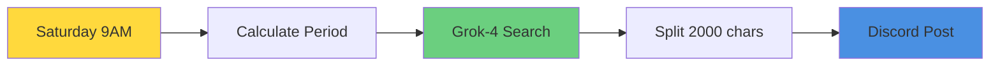
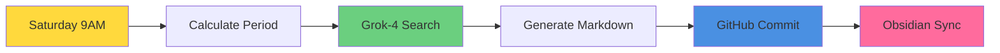

# 🤖 n8n Automation Workflows

This repository contains n8n workflow automation for AI news collection and management systems.

## 📋 Available Workflows

### 📰 [Grok News Discord](./grok-news-discord.md)
**Legacy Discord Notification System**

- **Purpose**: Weekly AI news aggregation from X (Twitter) to Discord
- **Schedule**: Every Saturday at 9 AM
- **Output**: Discord notifications with curated AI news
- **Status**: Legacy workflow

[📄 View Requirements & Documentation →](./grok-news-discord.md)

---

### 📚 [Grok News Obsidian](./grok-news-obsidian.md)
**Knowledge Management System with Obsidian Integration**

- **Purpose**: Weekly AI news aggregation with structured Obsidian knowledge management
- **Schedule**: Every Saturday at 9 AM  
- **Output**: Structured Markdown files in GitHub repository for Obsidian
- **Features**: YAML frontmatter, internal links, tags, automatic file organization
- **Status**: Active workflow

[📄 View Requirements & Documentation →](./grok-news-obsidian.md)

---

## 🏗️ Repository Structure

```
n8n-automation/
├── README.md                    # This file
├── CLAUDE.md                    # Repository guidelines & development rules
├── grok-news-discord.json       # Discord workflow definition
├── grok-news-discord.md         # Discord workflow requirements
├── grok-news-obsidian.json      # Obsidian workflow definition
└── grok-news-obsidian.md        # Obsidian workflow requirements
```

## 🚀 Quick Start

1. **Choose your workflow**:
   - For simple Discord notifications → [grok-news-discord](./grok-news-discord.md)
   - For advanced knowledge management → [grok-news-obsidian](./grok-news-obsidian.md)

2. **Import to n8n**:
   - Download the corresponding `.json` file
   - Import to your n8n instance
   - Configure credentials and settings

3. **Read requirements**:
   - Each workflow has detailed documentation in its `.md` file
   - Follow setup instructions and customization options

## 🔧 Technical Requirements

### Common Requirements
- **n8n instance** (self-hosted or cloud)
- **xAI API Key** for Grok-4 access
- **X (Twitter) API access** via Grok search

### Workflow-Specific Requirements

| Feature | Discord Workflow | Obsidian Workflow |
|---------|------------------|-------------------|
| **Output** | Discord Webhook | GitHub Repository |
| **Format** | Plain text (auto-split) | Structured Markdown |
| **Storage** | Temporary | Permanent |
| **Search** | None | Tags + Internal links |
| **Management** | Manual | Automated with Obsidian |

## 📚 Documentation

- **[CLAUDE.md](./CLAUDE.md)** - Development guidelines and repository rules
- **[grok-news-discord.md](./grok-news-discord.md)** - Discord workflow documentation
- **[grok-news-obsidian.md](./grok-news-obsidian.md)** - Obsidian workflow documentation

## 🔄 Workflow Comparison

### Discord Workflow (Legacy)


### Obsidian Workflow (Active)


## 📈 Features Comparison

| Feature | Discord | Obsidian |
|---------|---------|----------|
| **Real-time notifications** | ✅ | ❌ |
| **Long-term storage** | ❌ | ✅ |
| **Search & organization** | ❌ | ✅ |
| **Cross-referencing** | ❌ | ✅ |
| **Data portability** | ❌ | ✅ |
| **Setup complexity** | Low | Medium |
| **Maintenance** | Low | Low |

## 🏷️ Tags

`#n8n` `#automation` `#ai-news` `#grok` `#discord` `#obsidian` `#workflow` `#x-twitter`

---

📝 **Note**: This repository follows specific development guidelines documented in [CLAUDE.md](./CLAUDE.md). Please review before contributing or modifying workflows.

🤖 *Generated and maintained with [Claude Code](https://claude.ai/code)*