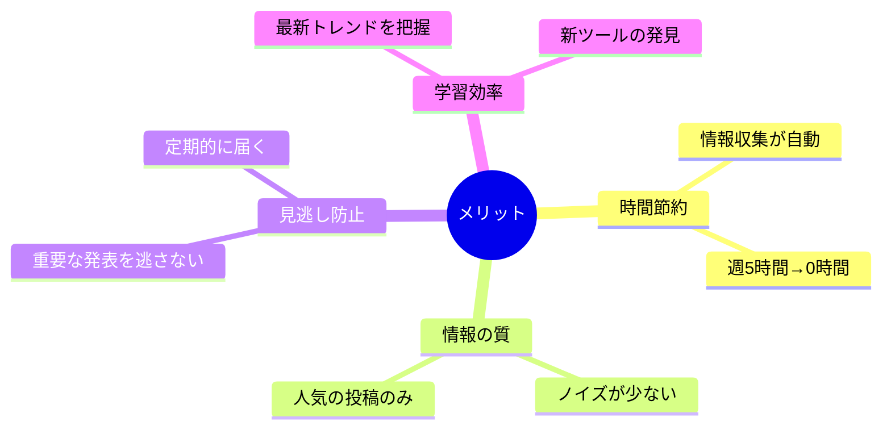

# 📰 Grok→Discord：AI週刊ニュース自動収集・管理システム
## 🎯 これは何？
毎週土曜日の朝に、Grok-4を使って過去1週間のAIニュースを自動で集めてDiscordに送ってくれるやつです。

## 😅 こんな悩みを解決

- AIの最新情報を追いかけるのが大変
- Xを毎日チェックする時間がない  
- 重要な発表を見逃しちゃう
- 情報が多すぎて何が重要かわからない

## 📋 やってくれること


## 🔍 どんな情報を集めるの？

### 集める情報
- 新しいAIツールのリリース（ChatGPTの新機能とか）
- 大事なアップデート情報
- 面白い活用事例
- 業界の大きなニュース

### フィルター条件
- 60いいね以上の人気投稿だけ（ゴミ情報を除外）
- 最大30件まで（多すぎても読めないし）
- 過去6日間の情報（1週間分をカバー）
- Xの投稿のみ（search_parameters.sources.type: "x"）

## 📢 どこから情報を取ってくる？

こんな感じの信頼できるアカウントから：
- **AI企業**: OpenAI、Anthropic、Google
- **開発ツール**: LangChain、n8n、Firebase  
- **有名人**: Sam Altmanとか
- **専門メディア**: AI Engineer、TestingCatalog
- **日本語**: 日本公式アカウント

要は、フォローしておきたいけど全部見る時間がないアカウントたちです。

## 📝 どんな感じで届く？

### こんなフォーマット
```
1. Claude 3.5の新機能が追加されました
   画像解析がめちゃくちゃ良くなったらしい...
   URL: https://x.com/anthropic/status/...

2. LangChainがPostgreSQLに対応
   データベース連携が簡単になった...
   URL: https://x.com/langchain/status/...
```

元のポストのURLも付いてるので、気になったら詳細を見に行ける！

## ⚙️ カスタマイズできる部分

### すぐ変えられるところ
1. **実行タイミング**
   - 今は土曜9時だけど、好きな曜日・時間に変更可能
   
2. **収集条件**
   - 期間を3日とか10日とかに変更
   - いいね数を100以上にして更に厳選
   - 件数を50件に増やす

3. **通知先**
   - Discord → Slackに変更
   - メールで受け取る
   - 複数の場所に同時送信

## 💡 使い方の例

### 週末のルーティン
土曜の朝にコーヒー飲みながら、1週間のAIニュースをサクッとチェック。気になる記事だけ深掘り。

### 月曜の朝
週末に届いたニュースを見て、今週試してみたいツールをピックアップ。

### アイデア探し
新しいAIツールの使い方を見て、自分のプロジェクトに応用できないか考える。

## ✨ これがあると何が良い？



## 🚀 始めるために必要なもの

1. **xAI API Key**（api.x.aiから取得）
   - Grok-4モデルへのアクセス
   - X検索機能の利用
2. **Discord Webhook URL**（Discordで作成）
   - 特定チャンネルへの投稿用
3. **Hostinger n8n環境**
   - セルフホスト型のワークフロー実行

以上！これで毎週自動でAIニュースが届くようになります。

## 📌 技術仕様

- **API**: xAI Chat Completions (api.x.ai/v1/chat/completions)
- **モデル**: grok-4
- **検索モード**: auto（自動検索）
- **文字数制限**: 2000文字で自動分割
- **実行環境**: Hostinger n8n (24時間稼働)
- **認証**: xAi API + Discord Webhook
- **出力**: Discord投稿（分割送信対応）

---

**要は「AIニュースを自動で集めて毎週教えてくれる便利な仕組み」です！**