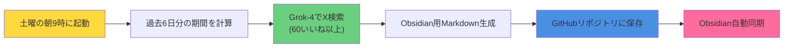
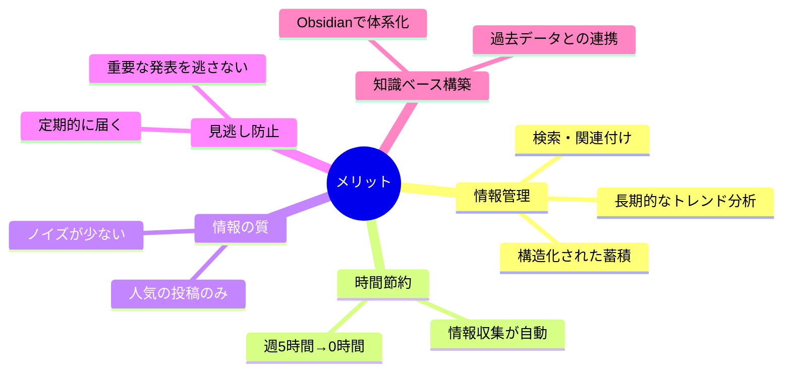

# 📰 Grok→Obsidian：AI週刊ニュース自動収集・管理システム

## 🎯 これは何？
毎週土曜日の朝に、Grok-4を使って過去1週間のAIニュースを自動で集めて、Obsidianで管理できるMarkdown形式でGitHubに保存してくれるやつです。

## 😅 こんな悩みを解決

- AIの最新情報を追いかけるのが大変
- Xを毎日チェックする時間がない  
- 重要な発表を見逃しちゃう
- 情報が多すぎて何が重要かわからない
- **収集した情報を体系的に管理・検索したい**
- **過去のニュースとの関連性を把握したい**

## 📋 やってくれること



## 🔍 どんな情報を集めるの？

### 集める情報
- 新しいAIツールのリリース（ChatGPTの新機能とか）
- 大事なアップデート情報
- 面白い活用事例
- 業界の大きなニュース

### フィルター条件
- 60いいね以上の人気投稿だけ（ゴミ情報を除外）
- 最大30件まで（多すぎても読めないし）
- 過去6日間の情報（1週間分をカバー）
- Xの投稿のみ（search_parameters.sources.type: "x"）

## 📢 どこから情報を取ってくる？

こんな感じの信頼できるアカウントから：
- **AI企業**: OpenAI、Anthropic、Google
- **開発ツール**: LangChain、n8n、Firebase  
- **有名人**: Sam Altmanとか
- **専門メディア**: AI Engineer、TestingCatalog
- **日本語**: 日本公式アカウント

要は、フォローしておきたいけど全部見る時間がないアカウントたちです。

## 📝 どんな感じで届く？

### Obsidian最適化Markdownフォーマット

```yaml
# フロントマター（YAML）
---
date: 2025-08-16
type: ai-weekly-news
source: grok-api
week: 2025-W33
tags: [ai, news, weekly, grok]
created: "2025-08-16T09:00:00.000Z"
period: "2025-08-10 to 2025-08-16"
---
```

```markdown
# 📰 AI週刊ニュース - 2025年08月16日

## 📊 今週のサマリー
- **収集期間**: 2025-08-10 〜 2025-08-16
- **フィルター**: 60いいね以上の人気投稿
- **情報源**: [[Grok API]]による自動収集

## 🤖 AI関連の注目ニュース
（Grokが生成したニュース内容）

## 🔗 関連リンク
- [[AI-Tools]] - 新しいAIツール一覧
- [[Weekly-Summary]] - 週次まとめ

## 🏷️ タグ
#AI #週刊ニュース #2025 #08月 #Grok
```

### ファイル管理
- **保存先**: `AI-News/YYYY-MM-DD-ai-weekly.md`
- **命名規則**: 日付ベースで自動整理
- **内部リンク**: `[[記法]]`でObsidian内横断
- **タグ**: `#記法`で検索・分類

## ⚙️ カスタマイズできる部分

### すぐ変えられるところ
1. **実行タイミング**
   - 今は土曜9時だけど、好きな曜日・時間に変更可能
   
2. **収集条件**
   - 期間を3日とか10日とかに変更
   - いいね数を100以上にして更に厳選
   - 件数を50件に増やす

3. **出力先**
   - GitHubリポジトリ変更
   - ファイル構造カスタマイズ
   - Markdownテンプレート調整

## 💡 使い方の例

### 週末のルーティン
土曜の朝にコーヒー飲みながら、1週間のAIニュースをObsidianでサクッとチェック。関連記事を[[内部リンク]]で辿って深掘り。

### 月曜の朝
週末に生成されたニュースを見て、今週試してみたいツールをピックアップ。タグで関連情報を検索。

### 長期的な知識管理
- 過去のトレンドを時系列で振り返り
- 特定のAIツールの進化を追跡
- 自分の関心領域の変化を分析

## ✨ これがあると何が良い？



## 🚀 始めるために必要なもの

1. **xAI API Key**（api.x.aiから取得）
   - Grok-4モデルへのアクセス
   - X検索機能の利用

2. **GitHub Personal Access Token**
   - リポジトリへの書き込み権限
   - ファイル作成・更新用

3. **GitHubリポジトリ**
   - Obsidian用プライベートリポジトリ
   - AI-News/フォルダ構造

4. **Obsidian + Git Plugin**
   - 自動同期設定
   - 内部リンク・タグ機能

5. **Hostinger n8n環境**
   - セルフホスト型のワークフロー実行

以上！これで毎週自動でAIニュースが整理されてObsidianに届くようになります。

## 📌 技術仕様

- **API**: xAI Chat Completions (api.x.ai/v1/chat/completions)
- **モデル**: grok-4
- **検索モード**: auto（自動検索）
- **出力形式**: Obsidian最適化Markdown + YAML フロントマター
- **実行環境**: Hostinger n8n (24時間稼働)
- **認証**: xAi API + GitHub Personal Access Token
- **同期**: GitHub → Obsidian Git Plugin
- **ファイル管理**: 日付ベース自動整理

## 🔄 従来版との違い

| 項目 | Discord版 | Obsidian版 |
|------|-----------|------------|
| **出力先** | Discord通知 | GitHub→Obsidian |
| **データ管理** | 一時的 | 永続的・構造化 |
| **検索性** | なし | タグ・内部リンク |
| **関連付け** | なし | 過去データと連携 |
| **フォーマット** | プレーンテキスト | Markdown+YAML |
| **長期活用** | 困難 | 知識ベース構築 |

## 🎨 Obsidianでの活用例

### ダッシュボードクエリ（Dataview）
```dataview
TABLE tags, period
FROM "AI-News"
WHERE type = "ai-weekly-news"
SORT date DESC
LIMIT 10
```

### 月次トレンド分析
```dataview
LIST
FROM "AI-News" 
WHERE contains(tags, "2025") AND contains(tags, "08月")
```

### 特定ツールの追跡
```dataview
TABLE date, file.link
FROM "AI-News"
WHERE contains(file.outlinks, [[ChatGPT]]) OR contains(file.outlinks, [[Claude]])
SORT date DESC
```

---

**要は「AIニュースを自動で集めて、Obsidianで体系的に管理できる便利な仕組み」です！**